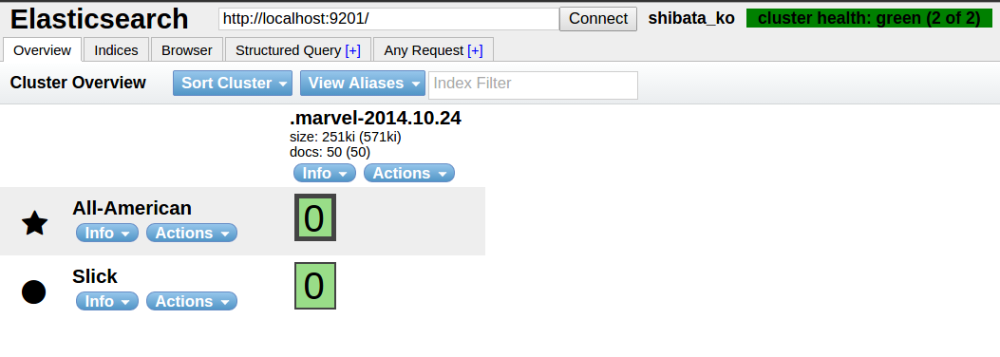

## 構成

ローカルに2つのノードを立てる。

デフォルトでは、

一つ目： cluster:elascicsearch, Node:[random]. port:9200

二つ目： cluster:elascicsearch, Node:[random]. port:9201

## headから見る

トップにあるのがクラスタ名

各ノードは行単位で示されている。（randamな名詞っぽいのがそれ）

各indexは列で示されている。

## 設定ファイル

elasticsearch-1.3.4/config/elasticsearch.yml

## cluster名を変更してみる。

elasticsearch.yml 32: cluster.name: elasticsearch

elasticsearchを任意の文字列にしてみる。

## Node名を変更

elasticsearch.yml 40: node.name: "Franz Kafka"

## データが同期されてるかを確認してみる。

一つのノードへデータを保存して、別ノードで取得してみる。

## 仕組み

同じLAN内にある仲間（同じcluster名のNode）を互いに確認しあってデータを同期するみたい。

elasticsearch.yml 295: Discovery

あたりに説明が書いてある。

デフォルトだとMultiCastで探すみたい（AWSはこれが使えないので別の方法を使うのだとか。）

